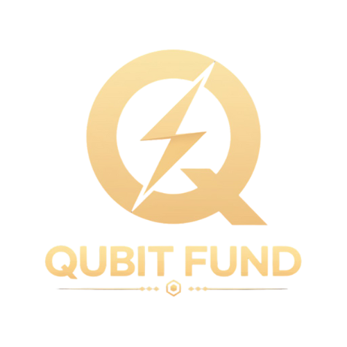
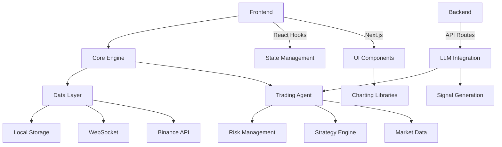
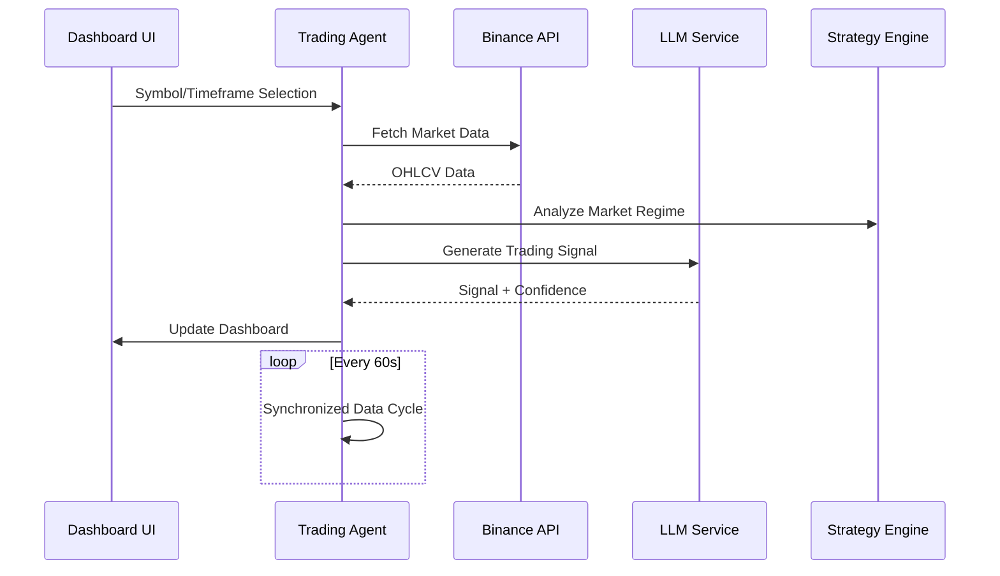
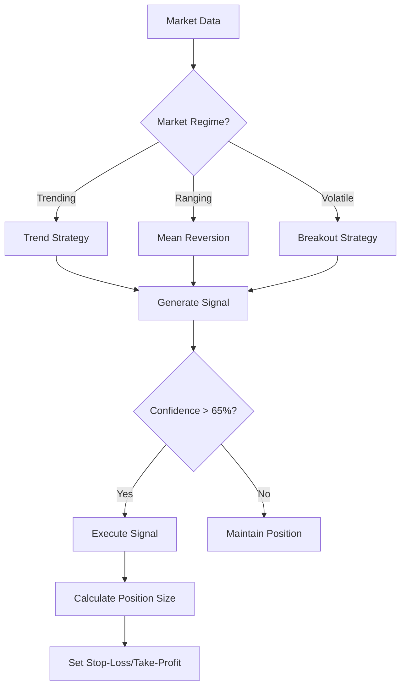

# Futures Quant Agents - AI-Powered Trading Dashboard



## Overview
Agentic trading platform integrating real-time market data, technical analysis, and large language models (LLMs) for AI-powered trading signals. Built with Next.js, TypeScript, and Tailwind CSS.

## Key Features
- 📈 Real-time market data visualization
- 🤖 AI-powered trading signal generation
- ⚙️ Custom strategy configuration
- 📊 Multi-timeframe analysis
- 🧪 Historical backtesting
- 🚦 Risk management controls
- 🔄 Synchronized 60-second data cycles

## Technical Architecture


## Data Flow


## Trading Decision Process


## Installation
```bash
# Clone repository
git clone https://github.com/yllvar/futures-quant-agents.git

# Install dependencies
pnpm install

# Start development server
pnpm run dev
```

## Configuration
1. Create `.env.local` file:
```env
NEXT_PUBLIC_EXCHANGE_API_KEY=your_binance_api_key
NEXT_PUBLIC_EXCHANGE_SECRET=your_binance_api_secret
HF_API_KEY=your_huggingface_key
DEEPSEEK_API_KEY=your_deepseek_key
```

2. Set API keys in dashboard:
```tsx
// In TradingDashboard component
const [apiKey, setApiKey] = useState("");
const [apiSecret, setApiSecret] = useState("");
```

## Key Components
| Component | Path | Description |
|----------|------|-------------|
| Trading Dashboard | `components/trading-dashboard.tsx` | Main interface |
| Trading Agent | `lib/trading-agent.ts` | Core trading logic |
| Strategy Engine | `lib/strategy-engine.ts` | Strategy management |
| LLM Service | `lib/llm-service.ts` | AI signal generation |
| Market Data Service | `lib/historical-data-service.ts` | Data fetching |

## Contributing
1. Send like the repo means a lot 
